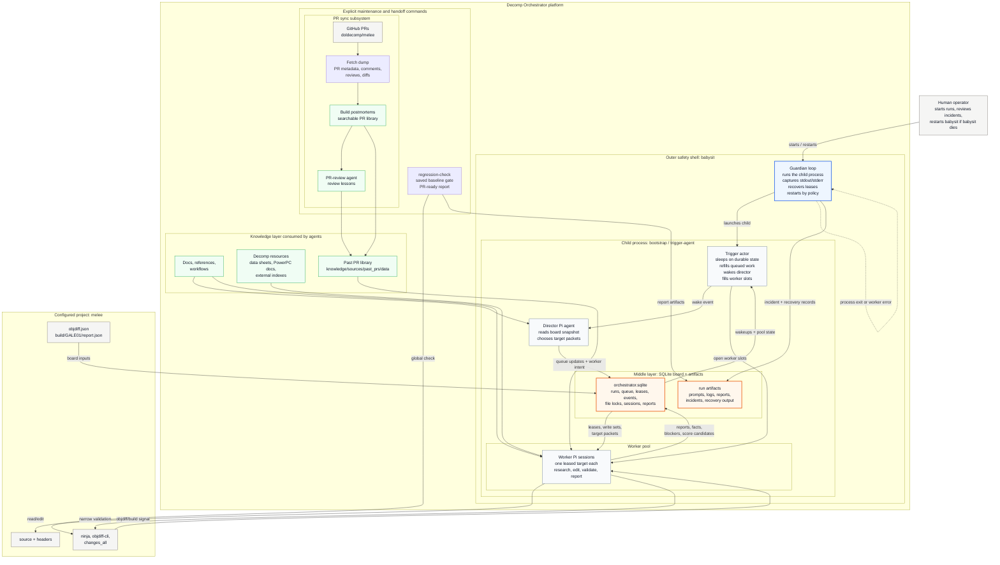

# Decomp Orchestrator

Decomp Orchestrator is a Bun workspace for coordinating configured
decompilation projects with Pi agents. The orchestrator is the platform
repository; project descriptors under `projects/<id>/` tell it which checkout,
state directory, graph database, process name, and local defaults to use.
`projects/melee/project.json` defines the Melee project, and ignored local
overrides attach a machine-specific checkout when needed.

The runner is intentionally thin: it owns durable state, leases, locks,
artifacts, process supervision, and Pi invocation. Director and worker Pi
agents own reasoning. Workers do not chat with each other; they coordinate by
writing reports, facts, blockers, score candidates, and wake events into the
shared run state.

## Architecture



Read the diagram from the outside in:

- The operator is the escape hatch for starting or restarting `babysit`.
- `babysit` is the outer runtime safety shell. It owns process health,
  incident capture, lease recovery, and restart policy.
- `bootstrap` / `trigger-agent` is the child process that advances the run from
  durable state: wake the director, start workers, then sleep.
- SQLite is the middle layer. The director, trigger actor, workers, guardian,
  and regression gate coordinate through board rows and artifact paths.
- PR sync, docs, references, and decomp resources feed the knowledge layer that
  director and worker prompts consume. PR sync is explicit maintenance today,
  not something the live trigger loop runs automatically.

## What Lives Here

| Area | Purpose |
| --- | --- |
| `apps/cli/` | CLI binary and commands: `init-run`, `tick`, `worker`, `trigger-agent`, `babysit`, `recover-leases`, `regression-check`, `kg:*`, and `status`. |
| `apps/dashboard/` | React/Vite dashboard frontend. |
| `apps/dashboard-server/` | Bun dashboard API, static serving, process controls, and PR handoff actions. |
| `packages/core/` | Board loading, SQLite state, shell helpers, report/regression logic, handoff helpers, env loading, and shared runtime types. |
| `packages/agents/` | Director, worker, PR-review, knowledge-curator, and shared Pi runtime prompt/output code. |
| `packages/knowledge/` | TypeScript knowledge graph/resource APIs over repo-level `knowledge/` data. |
| `packages/ui-contract/` | Browser-safe dashboard payload types and formatting helpers shared by UI and tests. |
| `projects/` | Tracked project descriptors plus ignored project-local checkouts, state, graph databases, env files, and Pi session directories. |
| `knowledge/` | Repo-level references, workflows, Melee resource indexes, tools, graph state, and past-PR corpus. |
| `docs/` | The deeper three-layer documentation set: foundation, system design, and implementation details. |
| `testdata/smoke_repo/` | Fixture Melee-like repo used by the smoke test. |

Project descriptors live at `projects/<project-id>/project.json`. Ignored local
overrides at `projects/<project-id>/local.project.json` can replace checkout,
state, graph, env, or process defaults without changing tracked config.
Explicit CLI flags and dashboard advanced path overrides still win over project
defaults. In project mode, run state and graph outputs default to the selected
project workspace, such as `projects/melee/state/` and
`projects/melee/graph/`. Raw path mode remains available for fixtures and
one-off compatibility runs.

## Quick Start

From the orchestrator root:

```sh
bun install
bun run check
bun run smoke
```

`bun run smoke` uses dry-run Pi agents and fixture board data. It proves the
vertical slice: load a board, queue targets, run a director cycle, lease a
worker, write artifacts, recover leases, exercise the trigger loop, and check
the guardian wrapper path.

Use the package command entry point for everything else:

```sh
bun run orch -- --help
bun run orch -- --project melee status
```

The tracked Melee descriptor defaults to `projects/melee/checkout/`. For local
development, either put a `doldecomp/melee` checkout there or create ignored
`projects/melee/local.project.json` with a `repoRoot` that points at an
external checkout. The checked-out repo is the project; the orchestrator stays
at the platform root.

For a local dashboard and process control surface:

```sh
bun run ui
```

The viewer opens a dense run dashboard at `http://localhost:8787`. It selects
the default project, exposes a project selector, keeps raw repo/state/graph
paths behind advanced overrides, shows starting/current report measures,
touched files, recent worker reports, events, process logs, and can start or
stop the supervised run from the platform root. Default UI launch settings come
from the selected project descriptor when present.

## Required Tools

Core package work needs:

- Bun
- Python 3
- Git

Live agent sessions also need `@earendil-works/pi-coding-agent` from
`bun install` and whatever provider/auth setup Pi needs for the selected
`--provider`, `--model`, and `--thinking-level`.

Project-specific provider keys belong in ignored env files. The CLI loads root
`local.env` for compatibility, then loads the selected project's configured
`localEnv` file, such as `projects/melee/local.env`, when `--project` is used.
For Codex LB, that env file can define `CODEX_LB_API_KEY=...` and
`PI_CODING_AGENT_DIR=.pi-agent` so each project can carry its own provider
config and spend attribution. Keep literal keys out of tracked files.

The orchestrator persists live Pi session files under ignored session
directories. Project workspaces may use `projects/<id>/.pi-sessions/` and
`projects/<id>/.pi-agent/`; root `.pi-sessions/` and `.pi-agent/` remain
supported for compatibility.

Live Melee runs need a configured doldecomp/melee checkout with the normal
toolchain, including `python configure.py`, `ninja`, `objdiff.json`,
`build/GALE01/report.json`, and `build/tools/objdiff-cli`.

PR knowledge refresh needs authenticated GitHub CLI access to
`doldecomp/melee`.

## Run Shape

Run these commands from the orchestrator root. Project mode resolves
repo/state/graph defaults from `projects/<id>/project.json`, then applies
ignored local overrides and explicit CLI flags. If no project is selected,
`--repo-root` defaults to the current working directory and `--state-dir`
defaults to `.decomp-orchestrator-state/` under the command working directory.

Initialize a run against the configured Melee project:

```sh
bun run orch -- --project melee init-run \
  --desired-workers 16 \
  --goal-kind matched_code_percent \
  --goal-value 72
```

Run the evented supervisor loop:

```sh
bun run orch -- --project melee bootstrap \
  --max-workers 16 \
  --idle-sleep-ms 5000
```

For long-running development runs, put the guardian around the system process:

```sh
bun run orch -- --project melee --agent-timeout-seconds 14400 babysit \
  --max-workers 16 \
  --idle-sleep-ms 5000 \
  --worker-thinking-level low
```

`bootstrap` is an alias for `trigger-agent`. It reloads current board artifacts
when the ready pool is low, refills queued targets toward the configured queue
target, starts worker sessions until active leases reach the configured worker
count, wakes the director for durable events, then sleeps when the board is
quiet. `babysit` wraps that process, captures stdout/stderr/results under
`state_dir/guardian/`, records incidents, runs lease recovery when appropriate,
and restarts according to policy.

For a high-parallelism run, keep worker count, queue target, and refill
watermarks separate:

```sh
bun run orch -- \
  --project melee \
  --provider codex-lb \
  --model gpt-5.5 \
  --thinking-level medium \
  babysit \
  --max-workers 32 \
  --worker-thinking-level low \
  --candidate-limit 64 \
  --queue-target-size 64 \
  --candidate-window 512 \
  --queue-refresh-interval-ms 60000 \
  --queue-low-watermark 16 \
  --schedulable-low-watermark 32 \
  --active-low-watermark 24 \
  --force-recover-leases
```

In this shape, `--queue-target-size 64` keeps roughly two queued targets per
worker, while `--candidate-window 512` lets refills scan much farther down the
current graph-ranked board for fresh candidates that have not already been
queued, leased, or reported. `--queue-refresh-interval-ms 60000` also refreshes
priorities for queued-but-not-leased targets from the latest graph-ranked board,
so new knowledge can change lease order before the old pool fully drains. If the
initial scan window is exhausted, refill automatically expands the scan until it
either restores the pool target or reaches the end of the ranked board. Each
refill reads the latest `build/GALE01/report.json` and `objdiff.json`;
rebuilding those artifacts is the step that refreshes the underlying score data.
When the project graph database is present, board ranking also uses graph
connectivity, resource evidence, historical lessons, and linked incomplete
functions before falling back to capped finishability. `--graph-db` can override
the project graph path for a specific command.

Use bounded flags for local dry runs:

```sh
bun run orch -- --repo-root testdata/smoke_repo --state-dir "$(mktemp -d)" \
  --dry-run-agents trigger-agent \
  --max-workers 1 \
  --max-iterations 5 \
  --max-idle-iterations 1 \
  --idle-sleep-ms 1
```

## Command Summary

| Command | Role |
| --- | --- |
| `init-run` | Create SQLite state, store the run checkpoint, load board data, queue initial targets, and write the initial board snapshot. |
| `tick` | Handle one wake event by running one director Pi cycle. |
| `worker` | Lease one queued target, run one worker Pi session, write durable report artifacts, release the lease, and emit a wake event. |
| `trigger-agent` / `bootstrap` | Resting supervisor loop that wakes the director and fills worker slots from durable state. |
| `babysit` | Process guardian that wraps `bootstrap`, records health incidents, recovers leases, and restarts the child when policy allows. |
| `recover-leases` | Convert interrupted or expired active leases into durable stalled reports after operator confirmation. |
| `regression-check` | Run the saved-baseline match-regression gate and write PR-ready report artifacts. |
| `pr-split-plan` | Group branch/worktree changes into smaller subsystem-scoped PR slices, label independence risk, and emit isolation-check commands for review handoff. |
| `status` | Print run, queue, lease, event, and report summaries. |

`bun run ui` launches the project-aware viewer for the same state. The UI sends
the selected `projectId` with dashboard, process, run, QA, and PR handoff
requests. Raw repo/state/graph paths are editable only through advanced
overrides, and UI stop requests use `recover-leases --force` so interrupted
leases return to durable stalled reports.

## Regression Gate

Workers perform local target validation while they work. Global score and PR
handoff stay outside the worker loop. Before review, refresh the project
checkout baseline and run the saved-baseline gate from the orchestrator root:

```sh
cd /path/to/melee
git switch master
git pull --ff-only origin master
python configure.py --require-protos
ninja baseline

git switch <branch>
python configure.py --require-protos
cd /path/to/decomp-orchestrator
bun run orch -- --project melee regression-check
```

`regression-check` wraps `ninja changes_all` inside the resolved project repo,
writes artifacts under the selected project state directory, parses
`build/GALE01/report_changes.json`, fails on regressions, and writes a
PR-style Markdown report at `<artifact-dir>/pr_report.md`.

The report also runs a PR promotion gate. By default, clean fuzzy-only movement
is classified as local evidence, not PR-ready evidence; promotion requires no
regressions plus an exact new match or real matched code/data byte movement.
Use `--require-pr-promotion` for final handoff checks so a clean but local-only
run exits nonzero instead of becoming maintainer-facing work by accident.

## PR Knowledge Refresh

The PR corpus is platform-owned and feeds worker prompts plus the PR-review
agent. Refresh it explicitly before live runs when recent PR knowledge matters:

```sh
bun run pr:refresh:dry
bun run pr:refresh
bun run pr:postmortems -- --dump-root knowledge/sources/code_context/past_prs/data --run-agent --pending-only --complete-only --jobs 16
```

For combined branch sync plus PR-library refresh:

```sh
bun run pr:sync -- --postmortem-jobs 16
```

PR refresh is not run automatically by `init-run`, `tick`, `worker`, or
`trigger-agent`.

## State And Artifacts

In project mode, `<state-dir>` defaults to the selected project state
directory. For `--project melee`, the tracked descriptor uses
`projects/melee/state/`, and local overrides may point elsewhere. Raw path mode
keeps the compatibility default of `<cwd>/.decomp-orchestrator-state/`.

Typical state layout:

```text
<state-dir>/
+-- orchestrator.sqlite
+-- guardian/
|   +-- system_runs/<system_run>/
|   +-- incidents/<incident>.json
|   +-- recoveries/<recovery>/result.json
+-- runs/
    +-- <run_id>/
        +-- snapshots/initial_board.json
        +-- director_cycles/
        +-- worker_logs/<lease_id>/
        |   +-- worker_<session>.system.md
        |   +-- worker_<session>.user.md
        |   +-- worker_<session>.txt
        |   +-- report/
        |       +-- worker_report.json
        |       +-- facts.json
        |       +-- blocker.json
        +-- smoke_summary.json
```

The SQLite database is the board memory. Prompt artifacts, Pi output, worker
reports, guardian incidents, recovery results, and regression reports live beside
it so runs can be inspected after the process exits.

## Current Boundaries

- Smoke tests use dry-run Pi agents and do not edit Melee source.
- Live worker sessions depend on ignored `local.env` plus the local Pi provider
  registry. For `codex-lb`, `local.env` points Pi at ignored `.pi-agent/`, whose
  `models.json` carries the project-specific provider config.
- The trigger loop does not refresh PR knowledge or run global regression checks
  automatically.
- `matched_code_percent` is the long-term progress metric. Run checkpoints such
  as `--goal-value 72` are batch pause/handoff thresholds, not the final project
  goal.
- The default work product is reviewable text-section/source code fixes,
  code-match blockers, or reusable source-shape facts. Data, literal, symbol,
  and split cleanup is secondary unless it is explicitly scoped, required for a
  code match, or blocking code-match validation.
- PR packaging is a separate handoff step. `pr-split-plan` can propose
  directory-scoped review slices and isolation checks, but the orchestrator does
  not publish PRs or create one PR per worker, lease, target, or file.

## Deeper Docs

- [Docs map](docs/README.md)
- [Foundation overview](docs/00-foundation/00-overview.md)
- [System design overview](docs/10-system-design/00-overview.md)
- [Run director loop](docs/10-system-design/10-run-director-loop.md)
- [Agent model](docs/10-system-design/20-agent-model.md)
- [Process guardians](docs/10-system-design/25-process-guardians.md)
- [Worker lifecycle](docs/10-system-design/40-worker-lifecycle.md)
- [CLI implementation](docs/20-implementation/cli/00-overview.md)
- [Original visual design](docs/design.html)
