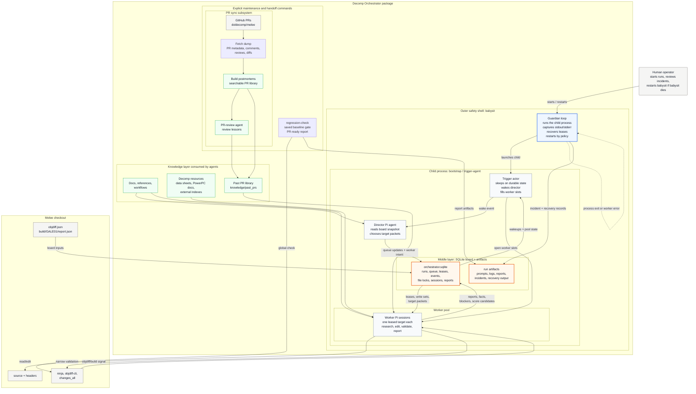

# Decomp Orchestrator

Decomp Orchestrator is a package-local runner for coordinating Melee
decompilation work with Pi agents. It can live inside a Melee checkout at
`<melee>/decomp-orchestrator`, but it is its own Git repository and command
surface.

The runner is intentionally thin: it owns durable state, leases, locks,
artifacts, process supervision, and Pi invocation. Director and worker Pi
agents own reasoning. Workers do not chat with each other; they coordinate by
writing reports, facts, blockers, score candidates, and wake events into the
shared run state.

## Architecture



Read the diagram from the outside in:

- The operator is the escape hatch for starting or restarting `babysit`.
- `babysit` is the outer runtime safety shell. It owns process health,
  incident capture, lease recovery, and restart policy.
- `bootstrap` / `trigger-agent` is the child process that advances the run from
  durable state: wake the director, start workers, then sleep.
- SQLite is the middle layer. The director, trigger actor, workers, guardian,
  and regression gate coordinate through board rows and artifact paths.
- PR sync, docs, references, and decomp resources feed the knowledge layer that
  director and worker prompts consume. PR sync is explicit maintenance today,
  not something the live trigger loop runs automatically.

## What Lives Here

| Area | Purpose |
| --- | --- |
| `src/cli/` | CLI commands: `init-run`, `tick`, `worker`, `trigger-agent`, `babysit`, `recover-leases`, `regression-check`, and `status`. |
| `src/agents/` | Director, worker, PR-review, and shared Pi runtime prompt/output code. |
| `src/state/` | SQLite schema and durable run-state helpers. |
| `knowledge/` | Package-owned references, workflows, Melee resource indexes, tools, and past-PR corpus. |
| `docs/` | The deeper three-layer documentation set: foundation, system design, and implementation details. |
| `testdata/smoke_repo/` | Fixture Melee-like repo used by the smoke test. |

Generated run state defaults to `<repo-root>/.decomp-orchestrator-state/`, not
inside this package. Local package outputs such as `node_modules/`, `dist/`, and
`init-run/` are ignored.

## Quick Start

From `decomp-orchestrator/`:

```sh
bun install
bun run check
bun run smoke
```

`bun run smoke` uses dry-run Pi agents and fixture board data. It proves the
vertical slice: load a board, queue targets, run a director cycle, lease a
worker, write artifacts, recover leases, exercise the trigger loop, and check
the guardian wrapper path.

Use the package command entry point for everything else:

```sh
bun run orch -- --help
```

## Required Tools

Core package work needs:

- Bun
- Python 3
- Git

Live agent sessions also need `@earendil-works/pi-coding-agent` from
`bun install` and whatever provider/auth setup Pi needs for the selected
`--provider`, `--model`, and `--thinking-level`.

Live Melee runs need a configured doldecomp/melee checkout with the normal
toolchain, including `python configure.py`, `ninja`, `objdiff.json`,
`build/GALE01/report.json`, and `build/tools/objdiff-cli`.

PR knowledge refresh needs authenticated GitHub CLI access to
`doldecomp/melee`.

## Run Shape

Initialize a run against a Melee checkout:

```sh
REPO_ROOT="/path/to/melee"
STATE_DIR="$REPO_ROOT/.decomp-orchestrator-state"

bun run orch -- --repo-root "$REPO_ROOT" --state-dir "$STATE_DIR" init-run \
  --desired-workers 16 \
  --goal-kind matched_code_percent \
  --goal-value 72
```

Run the evented supervisor loop:

```sh
bun run orch -- --repo-root "$REPO_ROOT" --state-dir "$STATE_DIR" bootstrap \
  --max-workers 16 \
  --idle-sleep-ms 5000
```

For long-running development runs, put the guardian around the system process:

```sh
bun run orch -- --repo-root "$REPO_ROOT" --state-dir "$STATE_DIR" babysit \
  --max-workers 16 \
  --idle-sleep-ms 5000 \
  --agent-timeout-seconds 7200 \
  --worker-thinking-level low
```

`bootstrap` is an alias for `trigger-agent`. It wakes the director when durable
events exist, starts worker sessions until active leases reach the configured
worker count, then sleeps when the board is quiet. `babysit` wraps that process,
captures stdout/stderr/results under `state_dir/guardian/`, records incidents,
runs lease recovery when appropriate, and restarts according to policy.

Use bounded flags for local dry runs:

```sh
bun run orch -- --repo-root testdata/smoke_repo --state-dir "$(mktemp -d)" \
  --dry-run-agents trigger-agent \
  --max-workers 1 \
  --max-iterations 5 \
  --max-idle-iterations 1 \
  --idle-sleep-ms 1
```

## Command Summary

| Command | Role |
| --- | --- |
| `init-run` | Create SQLite state, store the run checkpoint, load board data, queue initial targets, and write the initial board snapshot. |
| `tick` | Handle one wake event by running one director Pi cycle. |
| `worker` | Lease one queued target, run one worker Pi session, write durable report artifacts, release the lease, and emit a wake event. |
| `trigger-agent` / `bootstrap` | Resting supervisor loop that wakes the director and fills worker slots from durable state. |
| `babysit` | Process guardian that wraps `bootstrap`, records health incidents, recovers leases, and restarts the child when policy allows. |
| `recover-leases` | Convert interrupted or expired active leases into durable stalled reports after operator confirmation. |
| `regression-check` | Run the saved-baseline match-regression gate and write PR-ready report artifacts. |
| `status` | Print run, queue, lease, event, and report summaries. |

## Regression Gate

Workers perform local target validation while they work. Global score and PR
handoff stay outside the worker loop. Before review, run the saved-baseline gate
from the Melee checkout:

```sh
git switch master
git pull --ff-only origin master
python configure.py --require-protos
ninja baseline

git switch <branch>
python configure.py --require-protos
bun run --cwd decomp-orchestrator regression-check -- --repo-root "$PWD"
```

`regression-check` wraps `ninja changes_all`, writes artifacts under
`.decomp-orchestrator-state/regression_checks/`, parses
`build/GALE01/report_changes.json`, fails on regressions, and writes a PR-style
Markdown report at `<artifact-dir>/pr_report.md`.

## PR Knowledge Refresh

The PR corpus is package-owned and feeds worker prompts plus the PR-review
agent. Refresh it explicitly before live runs when recent PR knowledge matters:

```sh
bun run pr:refresh:dry
bun run pr:refresh
bun run pr:postmortems -- --dump-root knowledge/past_prs/current --run-agent --rerun-existing --jobs 16
```

For combined branch sync plus PR-library refresh:

```sh
bun run pr:sync -- --postmortem-jobs 16
```

PR refresh is not run automatically by `init-run`, `tick`, `worker`, or
`trigger-agent`.

## State And Artifacts

Typical state layout:

```text
<state-dir>/
+-- orchestrator.sqlite
+-- guardian/
|   +-- system_runs/<system_run>/
|   +-- incidents/<incident>.json
|   +-- recoveries/<recovery>/result.json
+-- runs/
    +-- <run_id>/
        +-- snapshots/initial_board.json
        +-- director_cycles/
        +-- worker_logs/<lease_id>/
        |   +-- worker_<session>.system.md
        |   +-- worker_<session>.user.md
        |   +-- worker_<session>.txt
        |   +-- report/
        |       +-- worker_report.json
        |       +-- facts.json
        |       +-- blocker.json
        +-- smoke_summary.json
```

The SQLite database is the board memory. Prompt artifacts, Pi output, worker
reports, guardian incidents, recovery results, and regression reports live beside
it so runs can be inspected after the process exits.

## Current Boundaries

- Smoke tests use dry-run Pi agents and do not edit Melee source.
- Live worker sessions depend on the local Pi provider/auth setup.
- The trigger loop does not refresh PR knowledge or run global regression checks
  automatically.
- `matched_code_percent` is the long-term progress metric. Run checkpoints such
  as `--goal-value 72` are batch pause/handoff thresholds, not the final project
  goal.
- PR packaging is a separate handoff step. The orchestrator does not create one
  PR per worker, lease, target, or file.

## Deeper Docs

- [Docs map](docs/README.md)
- [Foundation overview](docs/00-foundation/00-overview.md)
- [System design overview](docs/10-system-design/00-overview.md)
- [Run director loop](docs/10-system-design/10-run-director-loop.md)
- [Agent model](docs/10-system-design/20-agent-model.md)
- [Process guardians](docs/10-system-design/25-process-guardians.md)
- [Worker lifecycle](docs/10-system-design/40-worker-lifecycle.md)
- [CLI implementation](docs/20-implementation/cli/00-overview.md)
- [Original visual design](docs/design.html)
